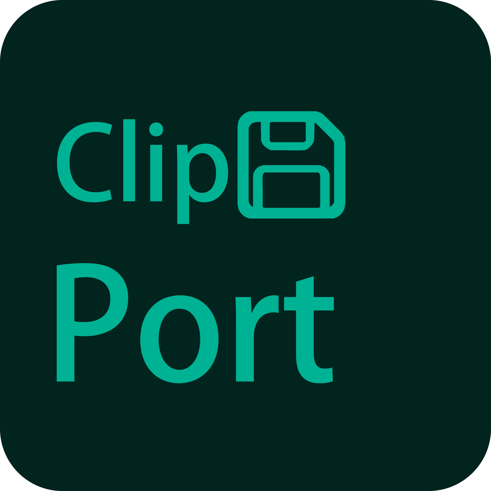

<div align="center">
  
  <h1>ClipPort</h1>
  <p>面向摄影、视频与大批量文件场景的 Windows 拷卡、完整性校验和任务管理工具。</p>
  <p>
    <a href="#功能概览">功能概览</a> ·
    <a href="#校验算法">校验算法</a> ·
    <a href="#windows-11-快速开启">快速开启</a> ·
    <a href="#构建与测试">构建与测试</a> ·
    <a href="#english-summary">English</a>
  </p>
  <p>
    <a href="https://github.com/MEMZ-Edge01/ClipPort/actions/workflows/ci.yml"></a>
    <a href="LICENSE"></a>
  </p>
</div>

## 项目简介

ClipPort 是一款使用 WinUI 3、C#、.NET 8 和 C++ 构建的 Windows x64 桌面应用。
它可以把存储卡或普通目录中的文件安全复制到指定位置，并按需重新读取源文件与目标文件，使用所选算法逐文件比较摘要。

应用不依赖账号、云服务或远程数据库。
设置、任务历史、日志和报告均保存在本机。

## 功能概览

### 安全复制与三种任务模式

| 模式 | 行为 |
| --- | --- |
| 复制并校验 | 使用所选算法重新读取并比较源文件与目标文件；默认在复制全部完成后校验，也可启用“拷贝时校验” |
| 仅复制 | 复制文件，但不计算校验摘要 |
| 只校验 | 不创建目标目录、不复制文件，仅校验目标目录中已有的对应文件 |

创建任务时至少需要启用复制或校验中的一项。

- 保留完整目录结构，包括空目录。
- 默认使用顺序异步复制，以 4 MiB 缓冲区流式处理文件。
- 先写入随机命名的 `.clipport-partial` 临时文件，完整写入后再提交到正式目标路径。
- 取消或单文件失败时清理临时文件，避免用半成品覆盖现有目标文件。
- 尽力保留源文件的最后修改时间；无法保留时记录警告，但不中断整个任务。
- 复制前检查目标磁盘空间，并拒绝危险的源目录、目标目录重叠关系。
- 跳过目录联接和符号链接，并阻止目标路径穿过重解析点，避免意外递归或写入非预期位置。
- 源目录采用后台流式枚举；扫描、目标目录预处理、重复项探测和容量检查不会占住界面线程，并实时显示已发现的目录数、文件数、数据量和当前路径。

### 可选校验算法

ClipPort 现在支持 `SHA-256`、`SHA-512`、`SHA-1`、`MD5` 和 `xxHash64`。
所选算法会贯穿普通任务、只校验、失败重试、覆盖后重新校验、历史记录和导出报告；旧历史记录或无效算法值会回退到 SHA-256。

所有算法均以 4 MiB 缓冲区流式读取文件，不会把整个文件一次性载入内存。
校验报告会标明实际算法，并记录源文件与目标文件的摘要。

开启“拷贝时校验”后，ClipPort 会用单个低 I/O 优先级后台工作器校验已经完整写入并提交的文件，复制始终具有更高优先级。
后台队列不会反向阻塞复制；队列繁忙或系统不支持后台优先级时，相关文件会在复制结束后继续校验。
该选项默认关闭，仅在同时启用复制和文件校验时生效；只校验任务仍按原有顺序执行。

### 重复文件处理

目标位置已经存在同名文件时，可以选择：

- 询问：先继续处理其他文件，随后逐项或批量决定。
- 覆盖：安全写入完成后替换目标文件。
- 跳过：保留现有目标文件。
- 创建副本：自动生成不冲突的新文件名。

询问模式支持多选、全选和批量应用处理策略。

### 多任务、优先级与恢复

- 可以创建多个任务并加入执行队列；同一时刻只执行一个任务，避免并发执行导致性能骤降或崩溃，任务会在“新任务”和“历史任务”区域中分别管理。
- 会阻止同时运行的任务使用相互冲突的源路径或目标路径。
- 勾选“优先执行”的任务会排到队列最前面，先于普通任务执行。
- 每个任务都可以独立暂停、继续、取消，并可选择在任务期间阻止电脑进入休眠。
- 失败、取消或意外中断的任务可以按原配置重新开始。
- 已完成复制的任务可以再次启动只校验任务，并沿用原任务选择的校验算法。
- 单个文件发生 I/O、权限或校验错误时，任务会继续处理其他文件。
- 任务结束前可以勾选失败文件并选择重试或跳过；摘要不一致的文件可以覆盖后重新校验。

### 实时进度与吞吐图

- 显示当前阶段、当前文件、完成百分比、文件数量、数据量、速度和耗时。
- 扫描阶段显示不定总量进度和已发现的数据，不会把尚未完成的扫描误报为 100%。
- 分别记录复制与校验阶段的字节速度和项目数速度。
- 提供实时波形、当前值、最高值、最低值和动态刻度；首个采样会铺满图表，后续样本从右侧进入并向左压缩，达到 90 点后滚动。
- 复制图表与校验图表都可以在并排布局和纵向堆叠布局之间切换。
- 吞吐采样会随任务历史保存，重新选择历史任务时仍可查看。

### 历史、报告与批量操作

- 任务历史以 JSON 保存在本机，最多保留 200 条非活动记录。
- 活动任务不会因为历史数量达到上限而被删除。
- 单条损坏的历史记录会被隔离，不影响其他有效记录。
- 支持删除单条记录或批量删除已结束的记录；删除记录不会删除源文件和目标文件。
- 支持导出单个报告，也可以为多个任务批量生成报告。
- 报告内容跟随应用语言，并包含任务模式、实际校验算法、摘要、失败、警告和重复项处理明细。

### 外观、语言与本地设置

- 支持跟随系统、浅色和深色三种外观模式。
- 支持 Windows 系统强调色，以及海沫绿、亮玫红、黄金色、浅薄荷色和紫影色五种预设颜色。
- 支持简体中文、English 和文言三种界面语言。
- 切换语言后可以立即安排应用安全重启，也可以稍后手动重启。
- 可以自定义日志和报告的保存目录。

### 自动更新

- “设置 → 关于 → 检查更新”会从 GitHub Releases 获取最新版本（预发布版本也会纳入检查）。
- 发现新版本后可以查看发布说明；确认后自动下载并校验 SHA-256，再重启应用完成更新。
- 更新采用便携目录整体替换，不覆盖设置、任务历史、日志和报告。

## 校验算法

| 算法 | 速度与摘要 | 兼容性与抗碰撞能力 | 建议用途 |
| --- | --- | --- | --- |
| SHA-256 | 速度与安全余量较均衡，256 位摘要 | 广泛支持，具备现代密码学抗碰撞能力 | 默认选择；重要素材交付和长期归档 |
| SHA-512 | 512 位摘要，计算开销通常更高 | 广泛支持，抗碰撞安全余量更高 | 对长期保存要求较高的归档 |
| SHA-1 | 通常较快，160 位摘要 | 便于兼容旧清单，但已不适合作为安全或防篡改证明 | 只用于必须兼容 SHA-1 的旧流程 |
| MD5 | 开销较低，128 位摘要 | 兼容性很高，但已不具备可靠的抗碰撞安全性 | 旧系统、旧清单或非安全兼容场景 |
| xxHash64 | 吞吐量优先，64 位摘要 | 非密码学算法，不用于防篡改证明 | 本机大批量快速完整性检查 |

> 校验摘要用于发现复制错误或文件变化，不等同于数字签名。
> 如果没有明确的兼容或吞吐量要求，建议保留默认的 SHA-256。

## 文件资源管理器快速开启

ClipPort 可以通过文件资源管理器右键菜单快速创建任务。

- 右击单个文件夹或文件夹空白处，打开“新建 ClipPort 任务”。
- 选择“作为源目录”或“作为目标目录”，ClipPort 会打开并预填新任务窗口。
- 如果 ClipPort 已在运行，请求会转交给现有实例并恢复窗口，不会启动多个主实例。
- 新式菜单在多选或选择非目录项目时不会显示该命令；传统菜单只注册到文件夹与文件夹空白处。
- 菜单标题跟随简体中文、English 或文言界面语言。

### 在发布包中启用

“设置 → 快速开启”提供两个互相独立的入口：

- **传统右键菜单（无需证书）**：直接注册到当前用户，无需管理员权限、签名证书或 MSIX。Windows 11 中从“显示更多选项”进入，也可用于 Windows 10。
- **Windows 11 新式右键菜单**：直接显示在首层右键菜单中，仅支持 Windows 11 版本 22000 或更高，由单独的稀疏 MSIX 组件提供。

如果只需要传统菜单，将完整发布目录放到固定位置，运行 `ClipPort.exe` 后打开“设置 → 快速开启”，仅开启“传统右键菜单（无需证书）”即可；下列证书与组件步骤都不需要执行。

若要启用 Windows 11 新式菜单：

1. 将完整发布目录放到固定位置，再运行 `ClipPort.exe`。
2. 打开“设置 → 快速开启”。
3. 如果是使用开发证书签名的测试版，先核对证书来源和指纹，再按页面指引将公开证书安装到“受信任人”。
4. 点击“安装组件”，等待页面确认注册成功。
5. 打开“Windows 11 新式右键菜单”开关。
6. 新开一个文件资源管理器窗口，右击文件夹或空白处进行测试。

发布目录需要同时包含 `ClipPort.ShellExtension.dll`、`ClipPort.ShellIntegration.msix` 和签名包所对应的 `ClipPort.ShellIntegration.cer`。
安装右键菜单组件后不要移动或拆分发布目录，因为稀疏包会引用该目录中的主程序和扩展 DLL。

## 使用方法

1. 点击“创建任务”，或通过文件资源管理器右键菜单预填源目录或目标目录。
2. 选择源目录或存储卡。
3. 如果启用复制，选择目标目录；可以额外填写目标子文件夹名。
4. 选择任务模式、校验算法、是否拷贝时校验、重复文件策略、休眠防止和优先执行选项。
5. 点击“开始任务”，在主界面查看实时进度与吞吐波形。
6. 如果出现重复文件或失败文件，按界面提示逐项或批量处理。
7. 任务结束后可以导出报告、重新开始或启动只校验任务。

## 本地数据

| 内容 | 默认位置 |
| --- | --- |
| 设置 | `%LOCALAPPDATA%\ClipPort\settings.json` |
| 任务历史 | `%LOCALAPPDATA%\ClipPort\history.json` |
| 日志 | `用户文档目录\ClipPort\ClipPort.log` |
| 自动报告 | `用户文档目录\ClipPort` |
| 更新缓存与更新器日志 | `%LOCALAPPDATA%\ClipPort\Updates` |

日志和报告目录可以在设置中更改。
日志达到 5 MiB 后会轮换为 `ClipPort.old.log`。

## 当前限制

- 当前发布目标仅为 Windows x64。
- 主程序是自包含目录发布，不是单文件程序，也不是完整应用 MSIX 安装包。
- Windows 11 右键菜单使用独立的稀疏 MSIX；测试版签名可能需要用户手动信任公开证书。
- 自动更新依赖 GitHub 网络访问；更新过程中应用会自动重启。
- C++ 原生复制引擎会随 Release 包构建和发布，但对应开关目前在界面中隐藏并禁用。
- 普通用户当前使用默认顺序复制路径；原生引擎和托管流水线仅用于代码级实验与回归测试，不应视为稳定的公开功能。

## 项目结构

```text
ClipPort
├── ClipPort.sln
├── packaging
│   └── ShellIntegration
├── scripts
│   ├── build-shell-package.ps1
│   ├── publish-beta.ps1
│   └── register-shell-package-for-development.ps1
├── src
│   ├── ClipPort
│   │   ├── Assets
│   │   ├── Models
│   │   ├── Services
│   │   ├── Strings
│   │   └── Views
│   ├── ClipPort.NativeCopy
│   └── ClipPort.ShellExtension
└── tests
    └── ClipPort.CoreTests
```

## 构建与测试

### 环境要求

- Windows 10 1809 或更高版本。
- .NET 8 SDK。
- Visual Studio 2022，并安装 MSBuild 与 C++ x64 桌面生成工具。
- 如需构建右键菜单包，还需要包含 `MakeAppx.exe` 与 `SignTool.exe` 的 Windows SDK。

原生 C++ 项目需要 Visual Studio MSBuild。
不要使用 `dotnet build ClipPort.sln` 代替完整发布流程，否则可能因为无法解析 C++ targets 而失败。

### 获取代码

```powershell
git clone https://github.com/MEMZ-Edge01/ClipPort.git
cd ClipPort
```

### 运行核心测试

```powershell
dotnet run --project .\tests\ClipPort.CoreTests\ClipPort.CoreTests.csproj -c Release
```

当前核心测试共 47 项，覆盖：

- 本地化资源完整性与语言查找。
- Windows 系统强调色预览。
- 五种校验算法的复制后校验、只校验和损坏检测。
- 校验不一致覆盖、暂停、继续和取消安全。
- 重复文件的询问、覆盖、跳过和创建副本。
- 单文件失败继续执行与失败重试。
- 空目录、路径安全和符号链接保护。
- 吞吐波形采样与显示格式。
- 后台流式扫描响应性、1.6 TB 元数据统计、拷贝时校验与超宽窗口布局。
- 设置容错、本地历史、损坏记录隔离和历史保留。
- 多语言报告、警告保留和优先任务调度。
- 快速开启请求的参数解析与目录预填逻辑，以及打包原生 DLL 的接口可用性。

### 构建 Release 自包含包

```powershell
powershell.exe -NoProfile -ExecutionPolicy Bypass -File .\scripts\publish-beta.ps1
```

脚本会：

1. 使用 Visual Studio MSBuild 构建 Release x64 解决方案、C++ 原生 DLL 和 Shell 扩展。
2. 检查 `App.xbf`、`MainWindow.xbf`、`TraeWorkTheme.xbf` 和 `SettingsView.xbf`。
3. 发布 `win-x64` 自包含运行时。
4. 发布独立的 `ClipPort.Updater.exe` 自包含更新器并放入发布目录。
5. 验证 `ClipPort.exe`、`ClipPort.dll`、`ClipPort.NativeCopy.dll`、`ClipPort.ShellExtension.dll`、`ClipPort.Updater.exe`、`resources.pri` 和语言资源。
6. 以安全的暂存与替换流程写入 `artifacts` 目录。
7. 传入 `-CreateZip` 时，额外生成 `ClipPort-{版本}-win-x64.zip` 与其 `.sha256` 校验文件，供 GitHub Release 上传。

默认输出位置：

```text
artifacts\ClipPort-1.0.0-beta-win-x64
```

未提供签名参数时，普通发布仍会成功，但会跳过 `ClipPort.ShellIntegration.msix`。

发布 GitHub Release（例如打 tag `v1.0.0-beta` 或手动触发 `release.yml`）时，CI 会执行上述脚本并上传 zip 与 SHA-256 文件。

### 构建签名的右键菜单组件

签名证书需要位于当前用户或本地计算机的 `My` 证书存储中，Publisher 必须与证书主题匹配。

```powershell
$env:CLIPPORT_SHELL_PACKAGE_PUBLISHER = "CN=Your Publisher"
$env:CLIPPORT_SHELL_PACKAGE_CERTIFICATE_THUMBPRINT = "YOUR_CERTIFICATE_THUMBPRINT"
powershell.exe -NoProfile -ExecutionPolicy Bypass -File .\scripts\publish-beta.ps1
```

脚本会构建并验证 `ClipPort.ShellIntegration.msix`，并把不含私钥的公开证书导出为 `ClipPort.ShellIntegration.cer`。

开发环境也可以在完成普通发布后使用松散清单注册，不需要生成可分发 MSIX：

```powershell
powershell.exe -NoProfile -ExecutionPolicy Bypass `
  -File .\scripts\register-shell-package-for-development.ps1 `
  -ExternalContentDirectory .\artifacts\ClipPort-1.0.0-beta-win-x64
```

## 技术栈

- .NET 8 / C# 12
- WinUI 3 / Windows App SDK
- C++20 / Win32 / `IExplorerCommand`
- `System.Security.Cryptography` 与 `System.IO.Hashing`
- JSON 本地持久化

## 许可证

Copyright (C) 2026 MEMZ-Edge01

本项目采用 [GNU General Public License v3.0](LICENSE) 授权。
你可以依照 GPL-3.0 使用、研究、修改和重新分发本项目；分发修改版或衍生作品时，需要继续采用 GPL-3.0、保留相应版权与许可证声明，并按许可证要求提供对应源代码。
本项目不提供任何明示或默示担保，完整条款请参阅 [LICENSE](LICENSE)。

## 参与贡献与安全

- 提交代码或文档前，请阅读 [贡献指南](CONTRIBUTING.md) 和 [行为准则](CODE_OF_CONDUCT.md)。
- 普通缺陷和功能建议请使用仓库的 Issue 模板。
- 安全漏洞不要提交公开 Issue，请按照 [安全策略](SECURITY.md) 通过 GitHub 的私密漏洞报告入口提交。

---

## English Summary

ClipPort is a Windows x64 desktop application for reliable media-card and directory transfers.
It supports responsive streaming source scans, safe file copying, verification-only jobs, duplicate-file policies, a serial task queue with priority ordering, pause and cancellation, failure recovery, local history, localized reports, and real-time byte/item throughput charts.

File verification can use SHA-256, SHA-512, SHA-1, MD5, or xxHash64.
SHA-256 is the default, and the selected algorithm is preserved across retries, re-verification, history, and reports.
An optional, default-off “verify while copying” mode verifies fully committed files on one low-priority background worker without allowing queue pressure to block copying; any backlog is completed after the copy phase.

On Windows 11, an optional sparse-MSIX shell component adds modern File Explorer commands for using a folder as the source or destination of a new ClipPort task.
Activation is redirected to the existing ClipPort window when the application is already running.

The native C++ copy engine is built and packaged for engineering validation, but its UI switch is currently hidden and disabled.
The default user-facing copy path is the sequential asynchronous implementation.

Run the 47 core tests:

```powershell
dotnet run --project .\tests\ClipPort.CoreTests\ClipPort.CoreTests.csproj -c Release
```

Build the self-contained Release package:

```powershell
powershell.exe -NoProfile -ExecutionPolicy Bypass -File .\scripts\publish-beta.ps1
```

## License

Copyright (C) 2026 MEMZ-Edge01

ClipPort is licensed under the [GNU General Public License v3.0](LICENSE).
You may use, study, modify, and redistribute the project under GPL-3.0.
Distributed modified versions and derivative works must remain under GPL-3.0, retain the applicable notices, and provide the corresponding source code as required by the license.
